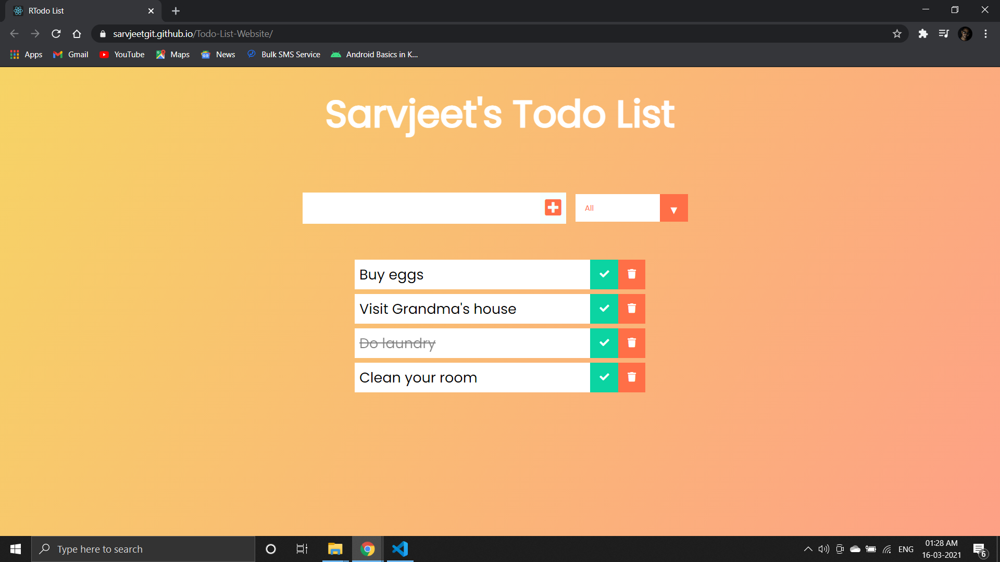

# TODO App 📝
- This is a todo app to manage your daily tasks.
- Functionalities of the app:
    - Add tasks
    - Mark them as complete or in progress
    - View ongoing and completed tasks
    - Delete tasks 
- It is built in React.js
***

## Screenshot:


***
## Run app on your local machine:
- Clone the repository 

    ```git clone https://github.com/SarvjeetGit/Todo-List-Website.git```
- Open the project in your favorite editor 
    ```cd Todo-List-Website/ ```
- Install the dependencies
    ```npm i ```
- Run the project in your local machine
    ```npm start```
***
Do fork and star ⭐ the repo if you find it appreciable. For any queries and suggestions, Conatct me at my mailing address.